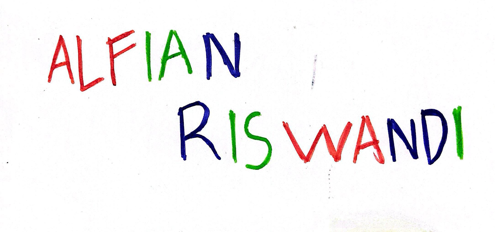
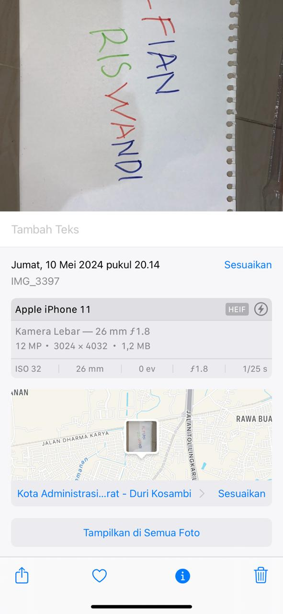

# UTS Pengelolahan Citra Digital

Nama = Alfian Riswandi

NIM = 202231005

Kelas = Pengelolahan Citra Digital (A)


## Screenshots

Gambar Asli


Informasi Gambar



## Proses Mengimport Library

Library

```bash
  import numpy as np
  import matplotlib.pyplot as plt
  import matplotlib.image as mpimg
  import cv2
  from matplotlib import pyplot as plt
```

## Teori Mendeteksi Warna 
Sebuah model warna yang paling umum digunakan dalam pengolahan gambar digital. Dalam model ini, setiap piksel direpresentasikan oleh tiga nilai warna: nilai merah (R), hijau (G), dan biru (B). Dengan mengkombinasikan nilai-nilai ini, kita dapat menciptakan berbagai warna.

## Mendeteksi Warna 

Warna Biru

```bash
# Membaca Gambar
image_path = 'nama.jpg'
img = cv2.imread(image_path)

# Proses Perubahan Warna
gray_img = cv2.cvtColor(img, cv2.COLOR_BGR2GRAY)

green_mask = cv2.inRange(img, (0, 50, 0), (50, 255, 50))  
red_mask = cv2.inRange(img, (0, 0, 50), (50, 50, 255))  
blue_mask = cv2.inRange(img, (50, 0, 0), (255, 50, 50))

combined_mask = cv2.bitwise_or(green_mask, cv2.bitwise_or(red_mask, blue_mask))

result_img = cv2.bitwise_and(img, img, mask=cv2.bitwise_not(combined_mask))

gray_img[combined_mask != 0] = 0  
gray_img[blue_mask != 0] = 128 

# Tampilan Gambar
# Gambar Asli
plt.subplot(1, 2, 2)
plt.imshow(cv2.cvtColor(img, cv2.COLOR_BGR2RGB))
plt.title('Gambar Asli')
plt.axis('off')

# Gambar yang Mendeteksi Warna Biru
plt.figure(figsize=(10, 10))
plt.subplot(1, 2, 1)
plt.imshow(gray_img, cmap='gray')
plt.title('Deteksi Warna Biru')
plt.axis('off')

plt.show()
```

Tampilan Gambar


Warna Merah

```bash
# Membaca Gambar
img = plt.imread('nama.jpg')

# Proses Perubahan Warna
img_gray = np.mean(img, axis=2)

fig, axs = plt.subplots(1, 2, figsize=(10, 5))

# Tampilan Gambar
# Gambar Asli
axs[0].imshow(img)
axs[0].set_title('Gambar Asli')
axs[0].axis('off')

# Gambar yang Mendeteksi Warna Merah 
axs[1].imshow(img_gray, cmap='gray')
axs[1].set_title('Deteksi Warna Merah')
axs[1].axis('off') 

plt.show()
```

Tampilan Gambar


Warna Merah

```bash
# Membaca gambar
image = cv2.imread('nama.jpg')

# Proses Perubahan Warna
image_rgb = cv2.cvtColor(image, cv2.COLOR_BGR2RGB)

lower_green = np.array([0, 100, 0])
upper_green = np.array([100, 255, 100])
green_mask = cv2.inRange(image_rgb, lower_green, upper_green)

lower_red = np.array([100, 0, 0])
upper_red = np.array([255, 100, 100])
red_mask = cv2.inRange(image_rgb, lower_red, upper_red)

lower_blue = np.array([0, 0, 100])
upper_blue = np.array([100, 100, 255])
blue_mask = cv2.inRange(image_rgb, lower_blue, upper_blue)

image_rgb[green_mask > 0] = [128, 128, 128]  
image_rgb[red_mask > 0] = [0, 0, 0] 
image_rgb[blue_mask > 0] = [0, 0, 0]  

# Menampilkan Gambar
# Gambar Asli
plt.imshow(cv2.cvtColor(image, cv2.COLOR_BGR2RGB))
plt.title("Gambar Asli")  
plt.axis('off')
plt.show()

# Gambar yang Mendeteksi Warna Hijau 
plt.imshow(image_rgb)
plt.title("Deteksi Warna Hijau")  
plt.axis('off') 
plt.show()
```
Tampilan Gambar


## Analisis Apa yang Terjadi Pada Citra

 - Deteksi warna biru dilakukan dengan menentukan rentang nilai RGB yang sesuai dengan warna biru, warna merah dan warna hijau.
 - Jika suatu piksel dalam gambar berada dalam rentang nilai tersebut, piksel tersebut diubah menjadi warna abu-abu untuk warna merah sama warna hijau dan warna hitam untuk warna biru pada gambar hasil.
 - Proses ini bertujuan untuk mengidentifikasi dan menekankan warna biru, warna merah, dan warna hijau dalam gambar, dengan mengubahnya menjadi warna hitam dan warna abu-abu untuk menciptakan kontras.

 Kesimpulan : Proses ini dilakukan untuk memisahkan bagian-bagian tertentu dalam gambar berdasarkan warna yang ditentukan (biru, merah, dan  hijau). Hal ini berguna untuk analisis visual yang lebih baik terhadap komposisi warna dalam gambar.

## Teori Histogram 
Sebuah grafik yang menunjukkan distribusi intensitas warna dalam gambar. Ini dapat membantu Anda melihat seberapa sering warna-warna tertentu muncul dalam gambar. Dengan menganalisis histogram warna, Anda dapat mengidentifikasi warna dominan dan membuat keputusan berdasarkan informasi tersebut.

 ## Histogram Pada Gambar
 Warna Biru

```bash
# Membaca Gambar
image_path = 'nama.jpg'
img = cv2.imread(image_path)

# Proses Perubahan Warna
gray_img = cv2.cvtColor(img, cv2.COLOR_BGR2GRAY)

green_mask = cv2.inRange(img, (0, 50, 0), (50, 255, 50))  
red_mask = cv2.inRange(img, (0, 0, 50), (50, 50, 255))  
blue_mask = cv2.inRange(img, (50, 0, 0), (255, 50, 50))

combined_mask = cv2.bitwise_or(green_mask, cv2.bitwise_or(red_mask, blue_mask))

result_img = cv2.bitwise_and(img, img, mask=cv2.bitwise_not(combined_mask))

gray_img[combined_mask != 0] = 0  
gray_img[blue_mask != 0] = 128 

# Tampilan Gambar
# Gambar Asli
plt.subplot(1, 2, 2)
plt.imshow(cv2.cvtColor(img, cv2.COLOR_BGR2RGB))
plt.title('Gambar Asli')
plt.axis('off')

# Gambar yang Mendeteksi Warna Biru
plt.figure(figsize=(10, 10))
plt.subplot(1, 2, 1)
plt.imshow(gray_img, cmap='gray')
plt.title('Deteksi Warna Biru')
plt.axis('off')

# Menampilkan Histogram
plt.subplot(1, 2, 2)
plt.hist(gray_img.ravel(), bins=256, range=[0, 256])
plt.title('Histogram Gambar Deteksi Warna Biru')
plt.xlabel('Intensitas Piksel')
plt.ylabel('Jumlah Piksel')
plt.grid()
plt.show()
```
Tampilan Gambar


Warna Merah

```bash
# Membaca Gambar
img = plt.imread('nama.jpg')

# Proses Perubahan Warna
img_gray = np.mean(img, axis=2)

fig, axs = plt.subplots(1, 2, figsize=(10, 5))

# Tampilan Gambar
# Gambar Asli
axs[0].imshow(img)
axs[0].set_title('Gambar Asli')
axs[0].axis('off')

# Gambar yang Mendeteksi Warna Merah 
axs[1].imshow(img_gray, cmap='gray')
axs[1].set_title('Deteksi Warna Merah')
axs[1].axis('off') 

# Histogram untuk Deteksi Warna Merah
plt.figure(figsize=(8, 6))
plt.hist(img_gray.ravel(), bins=256, range=(0, 256), color='red', alpha=0.7)
plt.xlabel('Intensitas Piksel')
plt.ylabel('Frekuensi')
plt.title('Histogram Deteksi Warna Merah')
plt.grid()
plt.show()
```
Tampilan Gambar


Warna Hijau

```bash
# Membaca gambar
image = cv2.imread('nama.jpg')

# Proses Perubahan Warna
image_rgb = cv2.cvtColor(image, cv2.COLOR_BGR2RGB)

lower_green = np.array([0, 100, 0])
upper_green = np.array([100, 255, 100])
green_mask = cv2.inRange(image_rgb, lower_green, upper_green)

lower_red = np.array([100, 0, 0])
upper_red = np.array([255, 100, 100])
red_mask = cv2.inRange(image_rgb, lower_red, upper_red)

lower_blue = np.array([0, 0, 100])
upper_blue = np.array([100, 100, 255])
blue_mask = cv2.inRange(image_rgb, lower_blue, upper_blue)

image_rgb[green_mask > 0] = [128, 128, 128]  
image_rgb[red_mask > 0] = [0, 0, 0] 
image_rgb[blue_mask > 0] = [0, 0, 0]  

# Menampilkan Gambar
# Gambar Asli
plt.imshow(cv2.cvtColor(image, cv2.COLOR_BGR2RGB))
plt.title("Gambar Asli")  
plt.axis('off')
plt.show()

# Gambar yang Mendeteksi Warna Hijau 
plt.imshow(image_rgb)
plt.title("Deteksi Warna Hijau")  
plt.axis('off') 
plt.show()

# Histogram untuk Deteksi Warna Hijau
green_pixels = image_rgb[:,:,1]  # Kanal hijau dari gambar RGB
plt.figure(figsize=(8, 6))
plt.hist(green_pixels.ravel(), bins=256, range=(0, 256), color='green', alpha=0.7)
plt.xlabel('Intensitas Hijau')
plt.ylabel('Frekuensi')
plt.title('Histogram Deteksi Warna Hijau')
plt.grid()
plt.show()
```
Tampilan Gambar


## Analisa Histogram

 - Jumlah piksel yang mendeteksi warna biru, warna merah dan warna hijau sekitar 1.4 mengindikasikan bahwa ada sejumlah kecil piksel dalam gambar yang termasuk dalam rentang warna yang telah ditentukan. Hal ini menunjukkan bahwa warna biru, warna merah dan warna hijau mungkin tidak dominan dalam gambar tersebut, atau mungkin hanya ada di beberapa bagian tertentu.
 - Intensitas piksel sekitar 250 pada histogram menunjukkan bahwa piksel-piksel yang mendeteksi warna biru, warna merah dan warna hijau memiliki intensitas yang cukup tinggi. Ini bisa berarti bahwa warna yang terdeteksi cukup terang atau jelas, bahkan jika jumlah pikselnya relatif sedikit.

 Kesimpulan : Gambar tersebut mungkin memiliki sedikit elemen dengan warna biru, warna merah dan warana hijau yang relatif terang atau jelas, tetapi tidak mendominasi gambar secara keseluruhan. Jumlah piksel yang mendeteksi warna tersebut yang rendah mengindikasikan bahwa warna biru, warana merah, dan warna hijau mungkin hanya ada di beberapa area tertentu dalam gambar.


## Teori Ambang Batas
Teori ambang batas (thresholding theory) dalam konteks warna digunakan untuk memisahkan atau mengklasifikasikan piksel-piksel dalam gambar berdasarkan nilai ambang yang ditentukan. Teknik ini sering digunakan dalam segmentasi gambar untuk memisahkan objek dari latar belakang atau untuk mengidentifikasi bagian-bagian tertentu dalam gambar berdasarkan karakteristik warnanya.
## Ambang Batas

Nilai Ambang Batas

```bash
# Membaca Gambar
image = cv2.imread('nama.jpg')

# Perubahan Warna Citra ke Warna HVS
hsv_image = cv2.cvtColor(image, cv2.COLOR_BGR2HSV)

# Proses Menentukan Batas HVS Warna Biru
lower_blue = np.array([100, 50, 50])
upper_blue = np.array([130, 255, 255])

# Proses Mendeteksi Warna Biru
mask_blue = cv2.inRange(hsv_image, lower_blue, upper_blue)

blue_image = cv2.bitwise_and(image, image, mask=mask_blue)

# Proses Pembuatan None
result_image_none = np.zeros_like(image)
result_image_none[mask_blue == 0] = [0, 0, 0]  # Ubah piksel yang tidak masuk rentang menjadi warna "none" (hitam)

# Proses Menentukan Batas HVS Warna Merah
lower_red = np.array([0, 50, 50])
upper_red = np.array([30, 255, 255])

# Proses Mendeteksi Warna Merah
mask_red = cv2.inRange(hsv_image, lower_red, upper_red)

# Proses Pengabungan Citra Warna Merah dan Warna Biru
red_image = cv2.bitwise_and(image, image, mask=mask_red)
result_image = cv2.bitwise_or(blue_image, red_image)
result_image[mask_blue != 0] = [255, 255, 255]
result_image[mask_red != 0] = [255, 255, 255]

# Tampilan Batas Ambang
fig, axs = plt.subplots(2, 3, figsize=(20, 15))
plt.subplots_adjust(wspace=0.5)

axs[0, 0].imshow(cv2.cvtColor(image, cv2.COLOR_BGR2RGB))
axs[0, 0].set_title('Gambar Asli')
axs[0, 0].axis('on')

axs[0, 1].imshow(cv2.cvtColor(result_image_none, cv2.COLOR_BGR2RGB))
axs[0, 1].set_title(f'None, Nilai: {lower_blue} - {upper_blue}')
axs[0, 1].axis('on')

axs[0, 2].imshow(mask_blue, cmap='gray')
axs[0, 2].set_title(f'Biru, Nilai: {lower_blue} - {upper_blue}')
axs[0, 2].axis('on')

axs[1, 0].imshow(cv2.cvtColor(result_image, cv2.COLOR_BGR2RGB))
axs[1, 0].set_title(f'Merah-Biru, Nilai: {lower_red} - {upper_red}')
axs[1, 0].axis('on')

axs[1, 1].imshow(cv2.cvtColor(result_image_all, cv2.COLOR_BGR2RGB))
axs[1, 1].set_title('Biru {}, Merah {}, Hijau {} - {}'.format(lower_blue, upper_blue, lower_red, upper_red, lower_green, upper_green))
axs[1, 1].axis('on') 
axs[1, 2].axis('off')

plt.show()
```
Tampilan Ambang Batas


## Nilai Ambang Batas

 - Ambang batas Merah-Biru (Red-Blue):

    Lower: [0, 50, 50]
    Upper: [30, 255, 255]

- Ambang batas None (Tidak ada warna):

    Lower: [100, 50, 50]
    Upper: [130, 255, 255]
- Ambang batas Blue (Biru):

    Lower: [100, 50, 50]
    Upper: [130, 255, 255]
- Ambang batas Merah-Biru-Hijau (Red-Blue-Green):

    Lower: [0, 50, 50]
    Upper: [30, 255, 255]
    Lower: [100, 50, 50]
    Upper: [130, 255, 255]

Kesimpulan : Nilai ambang batas terkecil dimilki sama Ambang batas Merah-Biru (Red-Blue) dan Nilai ambang batas terbesar dimiliki sama Ambang batas Merah-Biru-Hijau (Red-Blue-Green):

Nilai Ambang Batas : Dalam pengaturan HSV, nilai Hue (H) adalah komponen yang paling penting untuk mengidentifikasi warna. Rentang yang dipilih didasarkan pada ciri khas warna biru, merah, dan hijau dalam skala warna HSV. Pemilihan nilai-nilai ini disesuaikan dengan gambar dan preferensi deteksi warna yang diinginkan.